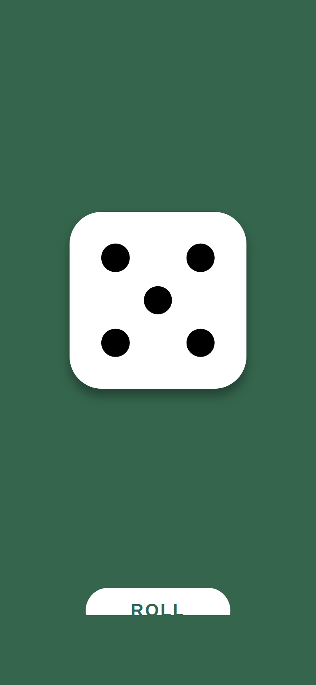

# Just a Simple Dice

[](https://github.com/laazyj/just-a-simple-dice-app-iOS/actions/workflows/ci.yml)
[](LICENSE)

One die. Tap **ROLL** or shake your phone. That's it.



## Why

Built for casual family gaming — board games on vacation, settling who goes
first, replacing the die that rolled under the sofa. Every dice app on the
store seems to bury a random number behind ads, pop-ups, cookie banners,
tracking, and in-app purchases.

This is just a nice skin over a random number generator:

- **No ads. No pop-ups. No cookies. No tracking. No in-app purchases.**
- No accounts, no analytics, and no network access at all — the app
  ships with a privacy manifest declaring zero data collection.
- Fair rolls from the system's cryptographic RNG.
- Haptic feedback and full VoiceOver support.

## Building

Open `JustASimpleDice.xcodeproj` in Xcode 16 or later and hit Run.
No dependencies, no package resolution, nothing to install.

## Testing

`⌘U` in Xcode, or:

```sh
xcodebuild test \
  -project JustASimpleDice.xcodeproj \
  -scheme JustASimpleDice \
  -destination 'platform=iOS Simulator,name=iPhone 16'
```

CI runs the same suite on every push and pull request — plus SwiftLint,
actionlint, and gitleaks — and uploads a simulator screenshot as a build
artifact.

## Shipping your own build

1. Set your bundle identifier and signing team in Xcode.
2. Product → Archive → Distribute App.
3. The App Store privacy questionnaire answers are all "No" —
   the app collects nothing.

## Contributing

This project is intentionally finished and doesn't accept pull requests —
adding features is how apps like this go bad. It's MIT licensed, so fork
away and make it your own.

## License

[MIT](LICENSE) — free to use, copy, and modify.
